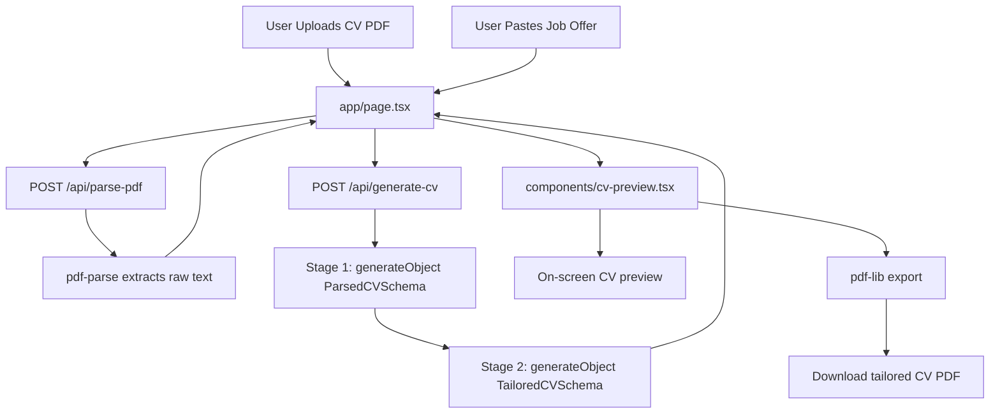

# Lady Nisy's CV Regenerator

AI-powered CV optimization system that converts an uploaded resume into structured JSON, aligns candidate experience with target job requirements, and generates a role-specific CV without fabricating facts.

This project is intentionally built to showcase AI Engineering capabilities: LLM pipeline design, provider abstraction, schema-constrained generation, prompt orchestration, and production-oriented reliability patterns.

## Why This Project

Job seekers often rewrite the same CV repeatedly for similar roles. Lady Nisy's CV Regenerator reduces that friction by automating the transformation process while preserving factual integrity.

Core goals:

1. Keep source-of-truth candidate data intact.
2. Tailor wording and emphasis to role requirements.
3. Return predictable structured output that is easy to render and export.

## Key Features

1. PDF CV upload and parsing (`/api/parse-pdf`)
2. Two-stage AI pipeline (`/api/generate-cv`):
   Stage 1: CV text to normalized JSON
   Stage 2: CV JSON plus job description to tailored CV JSON
3. Strong schema validation via Zod for reliable object output
4. Multi-step UX: upload, job description, generate, preview
5. Downloadable generated CV as PDF
6. Provider-flexible backend:
   OpenAI mode or GitHub Models mode

## AI Engineering Focus

1. Two-stage LLM architecture for traceable transformation:
  Stage 1 normalizes unstructured CV text into canonical JSON.
  Stage 2 performs job-aware rewriting from structured input.
2. Structured generation with Zod contracts to reduce malformed output risk.
3. Prompt design that enforces factual preservation and anti-fabrication behavior.
4. Runtime provider switching (OpenAI and GitHub Models) via environment configuration.
5. Operational guardrails through explicit env validation and actionable error handling.

## Tech Stack

1. Next.js 16 (App Router + Route Handlers)
2. React 19 + TypeScript
3. Vercel AI SDK (`ai`) + `@ai-sdk/openai`
4. Zod for schema-first validation
5. Tailwind CSS + shadcn/ui + Radix UI
6. `pdf-parse` for CV text extraction
7. `pdf-lib` for PDF generation
8. pnpm for package management

## Architecture Overview

1. `app/page.tsx` orchestrates the 3-step flow and API calls.
2. `app/api/parse-pdf/route.ts` extracts plain text from uploaded PDF bytes.
3. `app/api/generate-cv/route.ts` executes the AI pipeline:
   - parse source CV into structured JSON
   - tailor output based on job requirements
4. `components/cv-preview.tsx` renders output and exports PDF.

## Data Flow Map



## Project Structure

```text
app/
  api/
    generate-cv/route.ts
    parse-pdf/route.ts
  layout.tsx
  page.tsx
components/
  cv-preview.tsx
  file-upload.tsx
  step-indicator.tsx
lib/
  utils.ts
```

## Local Setup

1. Install dependencies:

```bash
pnpm install
```

2. Configure environment in `.env.local`.

OpenAI mode:

```env
AI_PROVIDER=openai
OPENAI_API_KEY=sk-...
OPENAI_MODEL=gpt-4o-mini
```

GitHub Models mode:

```env
AI_PROVIDER=github-models
GITHUB_MODELS_API_KEY=...
GITHUB_MODELS_MODEL=gpt-4.1-mini
GITHUB_MODELS_BASE_URL=https://models.inference.ai.azure.com
```

3. Start development server:

```bash
pnpm dev
```

4. Open:

```text
http://localhost:3000
```

## API Contracts

`POST /api/parse-pdf`

1. Input: PDF bytes (`application/octet-stream`)
2. Output: `{ text: string }`

`POST /api/generate-cv`

1. Input (`multipart/form-data`):
   - `cvText`
   - `jobOffer`
2. Output:

```json
{
  "parsedCv": { "fullName": "...", "skills": [] },
  "tailoredCv": { "fullName": "...", "sections": [] }
}
```

## AI and System Design Highlights

1. Schema-first LLM orchestration for deterministic, machine-usable outputs.
2. Clear separation between ingestion (`parse-pdf`), reasoning (`generate-cv`), and presentation (`cv-preview`).
3. Model-provider abstraction layer that supports backend portability.
4. Defensive runtime checks and explicit error surfaces for faster incident diagnosis.
5. End-to-end typed contracts across API boundary and UI consumption.

## Limitations

1. Parsing quality depends on source PDF structure.
2. Tailoring quality depends on job description detail.
3. No persistent user accounts/history yet.

## Roadmap

1. ATS match scoring and keyword coverage insights
2. Multiple export templates and layout presets
3. Cover letter generation from the same profile/job context
4. Saved sessions and authenticated user workspace

## Recruiter Note

This repository highlights AI Engineer strengths beyond prompt calls: architecting robust LLM workflows, enforcing structured outputs, integrating multiple model backends, and shipping an end-to-end product with practical user value.


